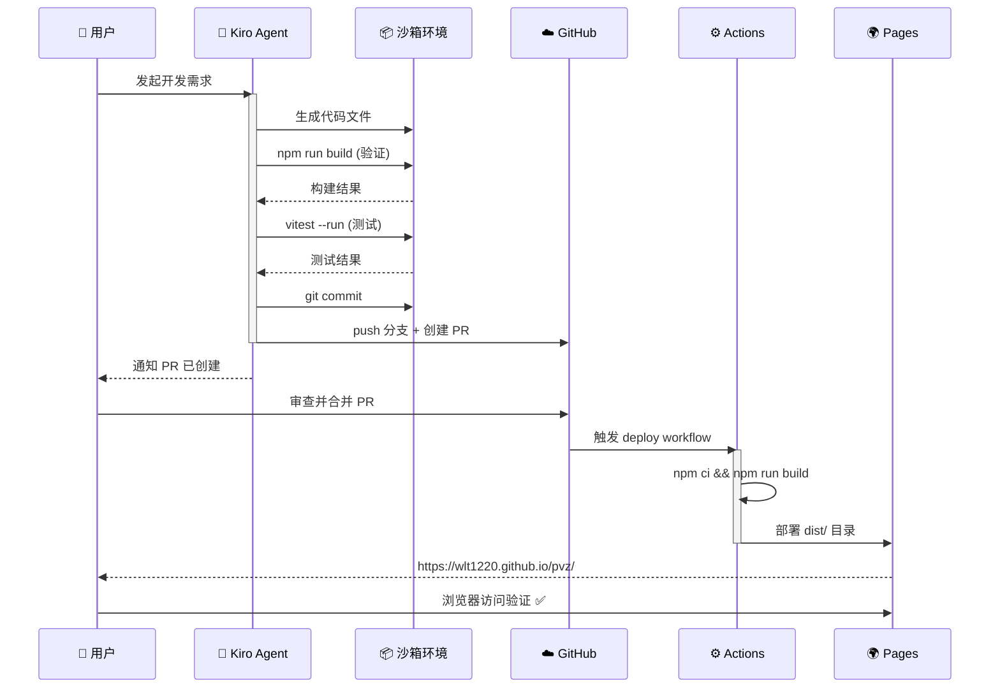

# Kiro Agent 编码到 GitHub Pages 部署完整流程图

## 流程概览

```mermaid
flowchart TB
    %% 样式定义
    classDef kiroEnv fill:#e3f2fd,stroke:#1565c0,stroke-width:2px
    classDef githubEnv fill:#f3e5f5,stroke:#7b1fa2,stroke-width:2px
    classDef actionsEnv fill:#fff3e0,stroke:#e65100,stroke-width:2px
    classDef pagesEnv fill:#e8f5e9,stroke:#2e7d32,stroke-width:2px
    classDef userAction fill:#fce4ec,stroke:#c62828,stroke-width:2px

    %% ========== 环境分区 ==========
    subgraph KIRO["🤖 Kiro Web 沙箱环境 (Linux Container)"]
        direction TB
        A[/"👤 用户发起需求<br/>(对话输入)"/]
        B["🧠 Kiro Agent 分析需求<br/>理解上下文 & 读取 Steering"]
        C["📝 生成/修改代码<br/>(React + Three.js + TypeScript)"]
        D["🔨 执行构建验证<br/>npm run build"]
        E{"构建成功?"}
        F["🐛 修复错误<br/>重新生成代码"]
        G["🧪 运行测试<br/>vitest --run"]
        H{"测试通过?"}
        I["📦 Git Commit<br/>提交到本地分支"]
        J["🚀 Push to Remote<br/>(github_push_to_remote)"]
        K["📋 创建 Pull Request<br/>(github_create_pull_request)"]
    end

    subgraph GITHUB["☁️ GitHub 远程仓库 (github.com/wlt1220/pvz)"]
        direction TB
        L["📥 接收 Push<br/>存储代码到分支"]
        M["📝 PR 创建/更新<br/>代码变更可审查"]
        N["👤 用户审查 & 合并 PR<br/>Merge to main"]
    end

    subgraph ACTIONS["⚙️ GitHub Actions (CI/CD Runner)"]
        direction TB
        O["🔔 触发 Workflow<br/>on: push to main"]
        P["📥 Checkout 代码"]
        Q["📦 安装依赖<br/>npm ci"]
        R["🔨 生产构建<br/>npm run build"]
        S["📤 上传构建产物<br/>Upload Artifact"]
        T["🌐 部署到 GitHub Pages<br/>Deploy Action"]
    end

    subgraph PAGES["🌍 GitHub Pages (CDN)"]
        direction TB
        U["📄 静态文件托管<br/>HTML/JS/CSS/Assets"]
        V["🔗 生成访问 URL<br/>https://wlt1220.github.io/pvz/"]
        W[/"✅ 用户访问验证<br/>浏览器打开网站"/]
    end

    %% ========== 流程连接 ==========
    A --> B
    B --> C
    C --> D
    D --> E
    E -->|失败| F
    F --> D
    E -->|成功| G
    G --> H
    H -->|失败| F
    H -->|通过| I
    I --> J
    J --> K

    K --> L
    J --> L
    L --> M
    M --> N

    N --> O
    O --> P
    P --> Q
    Q --> R
    R --> S
    S --> T

    T --> U
    U --> V
    V --> W

    %% ========== 应用样式 ==========
    class A,B,C,D,E,F,G,H,I,J,K kiroEnv
    class L,M,N githubEnv
    class O,P,Q,R,S,T actionsEnv
    class U,V,W pagesEnv
```



## 各环境职责详解

### 🤖 环境一：Kiro Web 沙箱 (开发环境)

| 步骤 | 工作内容 | 使用工具/命令 |
|------|----------|--------------|
| 需求理解 | 解析用户意图，读取 Steering 规则和 Learnings | Agent 内部推理 |
| 代码生成 | 创建/修改 React + Three.js + TS 源码 | `fs_write` / `str_replace` |
| 构建验证 | 确保代码能正确编译 | `npm run build` |
| 测试执行 | 运行单元测试确保逻辑正确 | `vitest --run` |
| Git 提交 | 将变更提交到本地 Git | `git add && git commit` |
| 推送远程 | 将分支推送到 GitHub | `github_push_to_remote` |
| 创建 PR | 发起代码审查请求 | `github_create_pull_request` |

**关键特点：**
- 这是一个 Linux 容器沙箱，有完整的 Node.js 运行时
- 无法启动 Dev Server（长进程受限），但可以执行构建和测试
- 所有 Git 操作通过 Kiro 专用工具完成（自动认证）

---

### ☁️ 环境二：GitHub 远程仓库 (代码托管)

| 步骤 | 工作内容 | 触发方式 |
|------|----------|----------|
| 接收代码 | 存储推送的分支和提交 | Kiro Push |
| PR 管理 | 展示代码差异，支持审查 | Kiro 创建 PR |
| 代码合并 | 用户审核后合并到 main 分支 | 用户手动操作 |

**关键特点：**
- 作为代码的中心存储和协作平台
- PR 是用户审查 Kiro 产出的关键节点
- 合并到 main 分支后触发部署流水线

---

### ⚙️ 环境三：GitHub Actions (CI/CD)

| 步骤 | 工作内容 | 配置文件 |
|------|----------|----------|
| 触发构建 | 监听 main 分支的 push 事件 | `.github/workflows/deploy.yml` |
| 安装依赖 | 下载项目所有 npm 依赖 | `npm ci` |
| 生产构建 | 生成优化后的静态文件 | `npm run build` |
| 部署上传 | 将 dist/ 发布到 GitHub Pages | `actions/deploy-pages` |

**关键特点：**
- 运行在 GitHub 提供的 Ubuntu Runner 上
- 完全自动化，无需人工干预
- 构建失败会通知，不会影响线上版本

---

### 🌍 环境四：GitHub Pages (生产托管)

| 步骤 | 工作内容 | 结果 |
|------|----------|------|
| 静态托管 | 提供 HTML/JS/CSS/资源文件服务 | CDN 加速分发 |
| URL 路由 | 处理 SPA 路由 (需 404.html 配置) | 单页应用支持 |
| HTTPS | 自动提供 SSL 证书 | 安全访问 |

**最终产出：** https://wlt1220.github.io/pvz/

---

## 简化时序图



---

## 需要在项目中配置的文件

```
pvz/
├── .github/
│   └── workflows/
│       └── deploy.yml          ← GitHub Actions 部署配置
├── vite.config.ts              ← base: '/pvz/' (关键！)
├── package.json                ← build script
├── src/                        ← 源代码
└── dist/                       ← 构建产物 (git ignore)
```

### `vite.config.ts` 关键配置

```typescript
export default defineConfig({
  base: '/pvz/',  // ← GitHub Pages 子路径，必须设置！
  // ...其他配置
})
```
